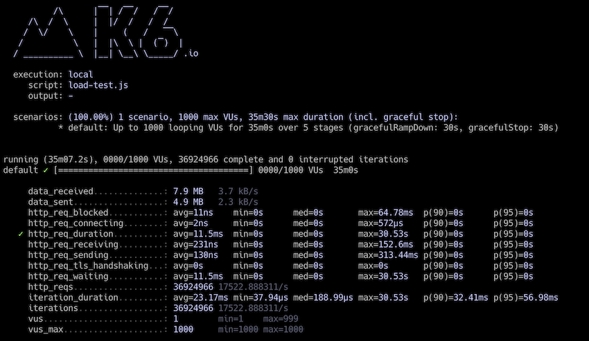

# API aggregation service

-------------------------

## Overview

API Aggregation Service consolidates the interface with external APIs into a single endpoint that can handle multiple logical requests in one network request.

#### Problem Statement :
- Each API accepts a query parameter ?q= that can accept multiple queries, split using a comma delimiter.
- If the same value is present multiple times in the query, the response will only contain it once. 
- All APIs to always return 200 OK responses with well-formed input, or 503 UNAVAILABLE when they are unavailable.
- These back-end services are delivered with an SLA guaranteeing a response time of at most 5 seconds for at least 99 percent of the requests.
- To prevent overloading the APIs with query calls we would like to consolidate calls per API endpoint.  
- All incoming requests for each individual API should be kept in a queue and be forwarded to the API as soon as a cap of 5 calls for an individual API is reached.
- If the queue cap for a specific service is not reached, the service queues should send the request within 5 seconds of the oldest item being inserted into the queue.

#### Assumption :
- All query parameters are mandatory for the aggregation endpoint
- Passing a query parameter with more than one element for a specific external endpoint is considered as one call even though it has more than one query value separated by a comma.
  For example, in the following request, only one call request will be added to the `shipments` API queue:
  
```shell
curl 'http://localhost:8181/aggregation?pricing=CN&track=109347263&shipments=109347263,123456891'
```  

#### Tech Stack Decision :

##### ZIO:

`ZIO` is a library for asynchronous and concurrent programming that is based on pure functional programming.

* *Asynchronous*: Lots of great data types like `Promise` and `Semaphore` are provided by this library which makes it a good fit to make asynchronous calls and combine the results
* *Queue*: It has built-in queue types which is being used to implement API queues namely `BulkDike`
* *Fiber*: The whole library is implemented using fibers. To perform an effect without blocking the current process, you can use fibers, which are a lightweight mechanism for concurrency
* *Environment Type*: Unlike other effect libraries, most of the `ZIO` data types support three types parameters to define environment, error and the result type.
  Using environment type we can define the requirements of an effect and thanks to the Layers we can pass them easily to the effect. This helps us to perform dependency injection without techniques like `Cakce pattern` or using `implicits`

##### Sttp:

`sttp` client is an open-source library which provides a clean, programmer-friendly API to describe HTTP requests and how to handle responses.

* *Backend implementations*: Requests are sent using one of the backends, which wrap other Scala or Java HTTP client implementations. The backends can integrate with a variety of Scala stacks, providing both synchronous and asynchronous, procedural and functional interfaces.
  Backend implementations include ones based on `akka-http`, `async-http-client`, `http4s`, `OkHttp`, and `HTTP clients` which ship with Java.
* *Library integration*: Backend implementations integrate with `Akka`, `Monix`, `fs2`, `cats-effect`, `scalaz` and `ZIO`
* *stub backend*: `sttp` supports stub backend to the test the application which allows specifying how the backend should respond to requests matching given predicates.

The HTTP client used to call the external API's are implemented using `sttp`.

##### http4s

* *composible*: `http4s` takes advantage of cats to achieve path `Matcher`. This feature makes it easier to not only compose routes but also it helps to add more directives like authorization and authentication to the routes
* *extensible*: Since route matcher is simply just `Kleisli`, extending http4s to support types other than `F[Response[F]]` will be much simpler. For example in this application it's extended to use `AppTask[A]` which is a type alias for `RIO[AppEnvironment, A]`

#### Solution :

##### FedEx Client:
FedEx Client (`FedexClient`) is a simple HTTP client implemented using `sttp` and `ZIO`. Internally it depends on `HttpClient` which helps to make HTTP calls.
Most of the error handling logic and request timeout configuration are implemented in `HttpClient` class

##### Aggregation Service API
Implementation of the Aggregation Service API can be found in `ApiAggregator` object which is the entry point of the application. It's a simple HTTP server which aggregates and redirects requests to the external APIs 

##### BulkDike

`BulkDike` is the heart of the system. All incoming requests for each individual API are sent to an instance of `BulkDike`. 
Internally it has a queue to store the query parameters as well as an instance of a `Promise` to return the response to the caller API in an asynchronous way.
Let's look at the signature of the `make` method which we can use to create an instance of `BulkDike`:

```scala
  def make[R, E, I: Semigroup, A](
    ...
    effect: I => ZIO[R, E, A],
    extractResult: (I, A) => A
  )
```

One of the arguments of the method is called `effect`. It's a function from `I` (Usually it is the query parameter(s)) to `ZIO[R, E, A]` which is the final effect type we intend to run.
`RouteHelper` object contains some variants of this function is used to make HTTP calls via `FedexClient`.
Another important argument of this method is `extractResult`. `BulkDike` uses this function to extract some part of the aggregated result associated with the input query parameter.

After creating an instance of `BulkDike` we can use the `apply` method to queue a new call request. 
Instead of adding the logic to make the call we only store the query parameters in the queue along with an instance of `Promise` (```Promise.make[E, A]```)

An internal stream that is connected to the queue consumes the elements in chunks (5 elements each time or any number of elements received within 5 seconds). 
Using `effect`, it makes the final API call to get the aggregated result. The last step is to complete the in-flight promises with the extracted results.

In order To prevent the queue from being overwhelmed, `BulkDike` constantly monitors the number of the queued elements as well as the number of in-flight calls. 
If the amount of workload exceeds the capacity of the server it starts to reject the requests.

## How to run 

### Prerequisites
The Project uses below tool versions :

|API name|Version|
|---|---|
|JDK|1.8+|
|Scala|2.13|
|Sbt|1.0+|
|Docker Compose|3.0+|

### Create Docker image
Run the following command to create a Docker image out of the project artifacts:

```shell
sbt docker:publishLocal
```

### Run Aggregation Service API
Using `docker-compose` we can run the Docker images:

```shell
docker-compose up -d
```

note: this command needs to be run from the root directory of the project in which the `docker-compose.yml` file exists. As another option the file can be passed to the command via `-f`:
```shell
docker-compose -f <path-to-docker-compose.yml> up
```


### Make HTTP call

```shell
curl 'http://localhost:8181/aggregation?pricing=CN&track=109347263&shipments=109347263'
```

### Stop container
Use the following command to stop the running container:

```shell
docker-compose down -v
```

### Run tests
```shell
sbt test
```

### Run load test

Project contains a load-test script to perform load and stress tests against the application. To run the test you need to install `k6` on your system.
Please follow the [instructions](https://k6.io/docs/getting-started/installation) to install `k6` then use the following command to run the load test:

```shell
k6 run load-test.js --log-output none
```

Here is the example of running test for 35 minutes with medium (100 user) and high load (1000 user):

